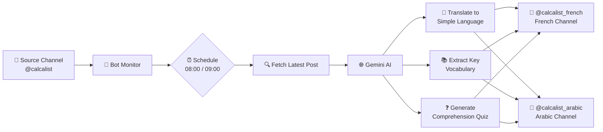

# 📚 Language Trainer Telegram Bot

Automated Telegram bot that transforms Hebrew/English news into language learning content for Arabic and French learners.

## 🎯 What Problem Does This Solve?

Language learners face a common challenge: **finding authentic content at their skill level**. News articles are perfect for learning because they cover real-world topics, but they're often too complex for beginners.

**The Challenge:**
- 📰 Real news is engaging but overwhelming for learners
- 📖 Simplified content feels artificial and boring
- 💭 Learners need vocabulary support without disrupting reading flow
- 🧠 Comprehension needs to be tested to ensure understanding

**The Solution:**
This bot creates an automated pipeline that:
1. Monitors Hebrew/English news channels
2. Translates content into simplified Arabic and French
3. Adds hidden vocabulary hints (click to reveal)
4. Posts comprehension quizzes to test understanding
5. Schedules daily posts automatically

Perfect for intermediate learners who want authentic content with built-in learning support.

## 📺 See It In Action

Check out the live channels to see the bot in action:

- 🇫🇷 **French Learning Channel**: [t.me/calcalist_french](https://t.me/calcalist_french)
- 🇸🇦 **Arabic Learning Channel**: [t.me/calcalist_arabic](https://t.me/calcalist_arabic)

Daily posts at 08:00 (French) and 09:00 (Arabic) Israel Time with translations, vocabulary, and quizzes!

## 🛠️ Main Tools

| Tool | Purpose | Why This Choice |
|------|---------|-----------------|
| **FastAPI** | Async web framework | Handles scheduling and webhooks efficiently |
| **Telethon** | Telegram MTProto client | Full API access for channels, media, polls |
| **Gemini AI** | Google's generative AI | Powers translation, vocabulary extraction, quiz generation |
| **APScheduler** | Background job scheduler | Reliable daily posting (08:00 French, 09:00 Arabic) |
| **Railway** | Cloud deployment platform | Simple deployment with environment variables |
| **uv** | Python package manager | Fast, modern alternative to pip/venv |

## 🔄 How It Works



**Daily Flow:**
1. **08:00 Israel Time** → Bot fetches latest @calcalist post
2. **Gemini AI** translates to simplified French + extracts vocabulary + generates quiz
3. **Posts to @calcalist_french** with hidden vocab/original text + quiz
4. **09:00 Israel Time** → Same process for Arabic → @calcalist_arabic

## 📁 Project Structure

```
LanguageTrainerTGBot/
├── 📡 conn_tg/              # Telegram client wrapper
│   ├── client.py            # TelegramClient class (Telethon)
│   ├── regenerate_session.py  # Generate new Telegram session
│   ├── split_session.py     # Split session for Railway env vars
│   └── test.py              # Test Telegram connection
│
├── 🤖 conn_ai/              # AI client wrapper
│   ├── client.py            # GeminiClient class
│   └── test.py              # Test AI translation/quiz
│
├── 🌐 api/                  # FastAPI application
│   ├── main.py              # App, endpoints, lifespan management
│   └── scheduler.py         # APScheduler jobs (morning posts)
│
├── 🔧 services/             # Business logic
│   └── post_processor.py    # Translation, vocabulary, quiz pipeline
│
├── ⚙️ config/               # Configuration
│   └── channels.py          # SOURCE_CHANNELS, TARGET_CHANNELS
│
├── 📄 .env.example          # Environment variable template
├── 📄 pyproject.toml        # uv dependencies
├── 📄 .gitignore            # Excludes .env, *.session
└── 📄 README.md             # You are here!
```

## 🚀 Getting Started

### Prerequisites

- **Python 3.12+** installed ([python.org](https://www.python.org/downloads/))
- **Telegram account** with phone number
- **Google AI account** for Gemini API ([ai.google.dev](https://ai.google.dev/))
- **Git** installed

### Step 1: Clone and Install

```bash
# Clone the repository
git clone https://github.com/Arseni1919/LanguageTrainerTGBot.git
cd LanguageTrainerTGBot

# Install dependencies with uv
uv sync

# Activate virtual environment
source .venv/bin/activate  # On Windows: .venv\Scripts\activate
```

> **Note:** `uv sync` automatically creates a virtual environment and installs all dependencies from `pyproject.toml`

### Step 2: Get API Credentials

#### Telegram API

1. Go to https://my.telegram.org
2. Log in with your phone number
3. Click "API development tools"
4. Create a new application (any name/description)
5. Note your **API ID** and **API Hash**

#### Gemini API

1. Go to https://ai.google.dev/
2. Click "Get API key in Google AI Studio"
3. Create a new API key
4. Copy your **Gemini API Key**

### Step 3: Configure Environment

```bash
# Copy template
cp .env.example .env

# Edit .env with your favorite editor
nano .env  # or vim, code, etc.
```

Fill in your credentials:
```env
TG_API_ID=your_api_id_here
TG_API_HASH=your_api_hash_here
TG_PHONE=+1234567890
GEMINI_API_KEY=your_gemini_key_here

# Session parts (generate in step 4)
TG_SESSION_PART1=
TG_SESSION_PART2=
TG_SESSION_PART3=

# Optional: SOCKS5 proxy if behind firewall
PROXY_HOST=
PROXY_PORT=
```

### Step 4: Generate Telegram Session

The bot needs an authenticated Telegram session to access channels.

```bash
cd conn_tg

# Generate session (you'll receive a Telegram code)
uv run python regenerate_session.py
# Enter the code from Telegram on your phone

# Split session into 3 parts for Railway
uv run python split_session.py

cd ..
```

The script will output three parts. Add them to your `.env`:
```env
TG_SESSION_PART1=<long_base64_string_part1>
TG_SESSION_PART2=<long_base64_string_part2>
TG_SESSION_PART3=<long_base64_string_part3>
```

> **⚠️ Note on Session Management:** This session splitting approach is a workaround for Railway's environment variable size limits (32KB per variable). **A better approach** is to use persistent volumes to store the session file directly. The session splitting method works but is less elegant - if your deployment platform supports volumes, use those instead.

### Step 5: Configure Channels

Edit `config/channels.py` with your channels:

```python
SOURCE_CHANNELS = [
    '@calcalist',  # or your news source channel
]

TARGET_CHANNELS = {
    'arabic': '@your_arabic_channel',
    'french': '@your_french_channel'
}
```

> **Note:** You must be an admin of the target channels or have posting permissions.

### Step 6: Test Components

```bash
# Test Telegram connection
cd conn_tg
uv run python test.py
# Should show: ✓ Logged in as: Your Name

# Test AI translation
cd ../conn_ai
uv run python test.py
# Should show: ✓ Translation successful

cd ..
```

### Step 7: Run Locally

```bash
# Start the FastAPI server
uv run uvicorn api.main:app --reload --host 0.0.0.0 --port 8000
```

**Expected output:**
```
✓ Telegram client connected
✓ Listening for new messages in ['@calcalist']
✓ Scheduler started:
  - French: 08:00 Israel Time
  - Arabic: 09:00 Israel Time
```

**Test the manual endpoint:**
```bash
curl -X POST http://localhost:8000/fetch-and-post
```

This fetches the latest post and translates it to both channels immediately.

## 📝 Post Format

Each post includes three components:

### 1. Main Message (Translation + Hidden Content)

**Example (French):**
```
Des scientifiques ont découvert une nouvelle espèce de papillon dans la forêt amazonienne.

Link: https://example.com/article

Vocabulaire important:
||
🦋 papillon - butterfly
Example: Le papillon est beau et coloré

🌳 forêt - forest
Example: La forêt amazonienne est immense
||

Texte original:
||
Scientists discover new species of butterfly in the Amazon rainforest.
||
```

**Features:**
- ✅ Simplified translation at the top (easy to read)
- 🔒 Hidden vocabulary (click/tap to reveal)
- 🔒 Hidden original text (for reference)
- 🔗 Preserved links from source

### 2. Comprehension Quiz (Separate Message)

**Example (French):**
```
Qu'est-ce qui a été découvert dans la forêt amazonienne?

A) Une nouvelle espèce d'arbre
B) Une nouvelle espèce de papillon  ✅
C) Une nouvelle espèce d'oiseau
D) Une nouvelle espèce de fleur
```

**Quiz Format:**
- Multiple choice (4 options)
- Tests actual comprehension
- Instant feedback on selection

## 🌐 Deployment

### Deploy to Railway

Railway provides easy deployment with automatic CI/CD from GitHub.

#### 1. Connect Repository

1. Go to [Railway](https://railway.app/)
2. Sign up/login with GitHub
3. Click "New Project" → "Deploy from GitHub repo"
4. Select `Arseni1919/LanguageTrainerTGBot`

#### 2. Add Environment Variables

In Railway dashboard, go to your service → Variables tab. Add all variables from your `.env`:

```
TG_API_ID=your_api_id
TG_API_HASH=your_api_hash
TG_PHONE=+1234567890
TG_SESSION_PART1=<your_part1>
TG_SESSION_PART2=<your_part2>
TG_SESSION_PART3=<your_part3>
GEMINI_API_KEY=your_gemini_key
```

Optional proxy variables:
```
PROXY_HOST=your_proxy_host
PROXY_PORT=your_proxy_port
```

> **Important:** Do NOT add `TARGET_CHANNEL_ID` - channels are configured in `config/channels.py`

#### 3. Deploy

Railway auto-deploys when you push to `main` branch:

```bash
git push origin main
```

Watch deployment logs in Railway dashboard.

#### 4. Verify Deployment

Check logs for successful startup:
```
✓ Session file restored
✓ Logged in as: Your Name (your_username)
✓ Listening for new messages in ['@calcalist']
✓ Scheduler started:
  - French: 08:00 Israel Time
  - Arabic: 09:00 Israel Time
```

**Test the endpoint:**
```bash
curl -X POST https://your-app.railway.app/fetch-and-post
```

Check your Telegram channels - you should see new posts!

### Other Platforms

The app works on any platform that supports:
- Python 3.12+
- Environment variables
- Long-running processes

Tested on: **Railway**, **Render**, **Fly.io**, **Docker**

See `DEPLOYMENT.md` for detailed guides for other platforms.

## 📖 Usage

### Manual Posting

```bash
curl -X POST https://your-app.railway.app/fetch-and-post
```

Posts immediately to both channels (Arabic + French).

### Scheduled Posting

Automatic posts happen daily:
- **08:00 Israel Time** → French (@calcalist_french)
- **09:00 Israel Time** → Arabic (@calcalist_arabic)

No manual intervention needed!

### Auto-Repost on New Messages

The bot monitors `SOURCE_CHANNELS` for new posts. When a new message is detected, it automatically:
1. Translates to both languages
2. Posts to both channels
3. Includes vocabulary and quiz

This ensures your channels stay up-to-date in real-time.

## 🤝 Contributing

Contributions are welcome! Here's how to get started:

1. **Fork the repository**
2. **Create a feature branch** (`git checkout -b feature/amazing-feature`)
3. **Test your changes** locally
4. **Commit your changes** (`git commit -m 'Add amazing feature'`)
5. **Push to your branch** (`git push origin feature/amazing-feature`)
6. **Open a Pull Request**

### Development Guidelines

- Keep code minimal and clean (no unnecessary comments)
- Test components in isolation before integration
- Follow existing code structure (conn_tg, conn_ai, services)
- Update CLAUDE.md if you change architecture

## 📚 Additional Documentation

- **CLAUDE.md** - Detailed development guide and architecture
- **DEPLOYMENT.md** - Platform-specific deployment guides
- **RAILWAY_SETUP.md** - Railway deployment specifics
- **QUIZ_POLL_REFERENCE.md** - Telegram quiz poll implementation reference

## 📄 License

MIT License - see LICENSE file for details

## 🙏 Acknowledgments

- **Telethon** - Excellent Telegram client library
- **Google Gemini** - Powerful AI for translation and content generation
- **FastAPI** - Modern, fast web framework
- **Railway** - Simple deployment platform

---

**Built with ❤️ for language learners**

Happy learning! 🎓
